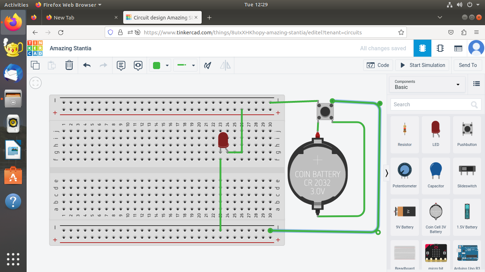

(#10 day internship
>day-1
- github
- acc making in github
- made .md file 
> uese of symbol
1. using # for big size
2. ling
3. linking link
4. code
```
f=int(input("enter a number")
h=int("input("enter a number")
sum=f+h
print("sum=",sum)
```
[lukosevv/vvl](https://github.com/lukosevv/vvl)


#DAY 2





#DAY 3


[thinker this](https://www.tinkercad.com/things/8uIxXHKhopy-amazing-stantia/editel?tenant=circuits)

[thinker this](https://www.tinkercad.com/things/adxwkp20WCi-smooth-elzing/editel?tenant=circuits)

[thinker this](https://www.tinkercad.com/things/bNyTkXKGWgF-grand-bigery-lappi/editel?tenant=circuits)

CODE
// C++ code
//
void setup()
{
  pinMode(LED_BUILTIN, OUTPUT);
}

void loop()
{
  digitalWrite(LED_BUILTIN, HIGH);
  delay(1000); // Wait for 1000 millisecond(s)
  digitalWrite(LED_BUILTIN, LOW);
  delay(1000); // Wait for 1000 millisecond(s)
}
